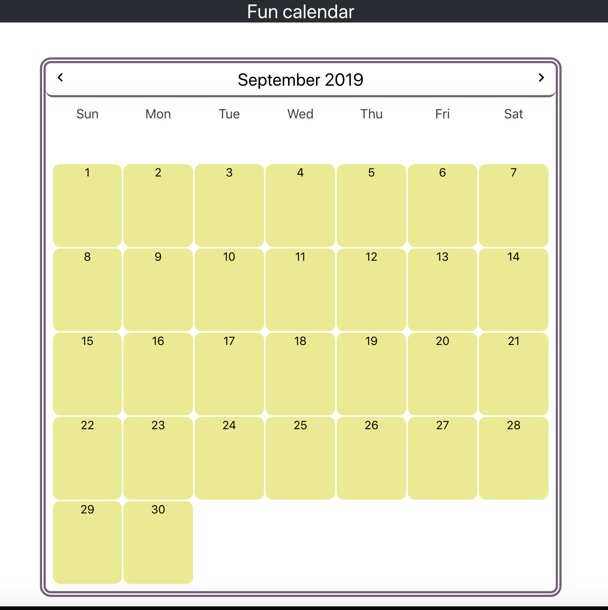

# Calendar Application

This project consists of a calendar application, that supports multiple month views as well as the ability to save and display a list of reminders associated with a particular month.

The calendar view is responsive and changes layout according to the size of the viewport. Different months can be selected and are rendered correctly from the start day of the week. In addition, if a calendar cell is clicked, a new text reminder can be created.

Currently, the reminders are saved in the `Calendar` component state and contain the `text` and the `month` and `day` of the reminder. Future iterations can include rendering the reminder on the date that is clicked ordered by time, editing and deleting reminders. The application design caters for extensibility of such kind.

This web application was bootstrapped using `Create React Apps` and utilises `React 16.9` with `ES6` features and `Jest snapshot testing`. The styling is achieved using CSS modules, which are picked up by the `.module.css` file extension. They are applied only on a component level and in this project lack of nested CSS classes is preferred.

## Future proofing the calendar application

This project is just laying the foundations of the calendar application. There is a scope for extension and improvements in a lot of areas a production ready web application can touch:

1. Advance test coverage with more edge cases, include enzyme and/or react-testing-library for component testing. Take advantage of user centric testing with react-testing-library and shallow rendering with enzyme. Consider other types of testing including visual regression and e2e.

2. Integrate static type checking for props and functions utilising Flow or TypeScript to expand on error prevention.

3. Move most of the component state to Redux store as a single source of truth and decrease callbacks and passing of state down multiple levels. Integrate selector libraries to compute derived state.

4. Refactor components such as CalendarDays, extract logic into functions even further, rethink mechanism for reminders date handling, reduce the levels in which Calendar state is passed down (use Redux in the future here). Evaluate use case for advanced React 16.8+ features such as Hooks.

5. Rethink calendar design for different viewports and improve CSS handling of media queries and spacing.

6. [Larger scale app] Utilise advanced Webpack features like Code Splitting, eject Create React app and modify the bundler configs if needed. Think about distinction between production vs dev environment. Consider adding a static server with Express. Consider productionisation of the application and potentially automated cloud deployment mechanisms. Consider automated alerting and performance metrics.

## Available Scripts

In the project directory, you can run:

### `npm install`

To install the deps, specified in `package.json`.

### `npm start`

To the app in the development mode. 
Open [http://localhost:3000](http://localhost:3000) to view it in the browser.

The page will reload if you make edits. 
You will also see any lint errors in the console.

### `npm test`

To launch the test runner in the interactive watch mode. 
A basic set of Jest / snapshot tests were written to check for render crashes and mostly positive test case scenarios.

### `npm run build`

To build the app for production to the `build` folder. 
It correctly bundles React in production mode and optimizes the build for the best performance.
The build is minified and the filenames include the hashes. 

## Calendar app initial screen

